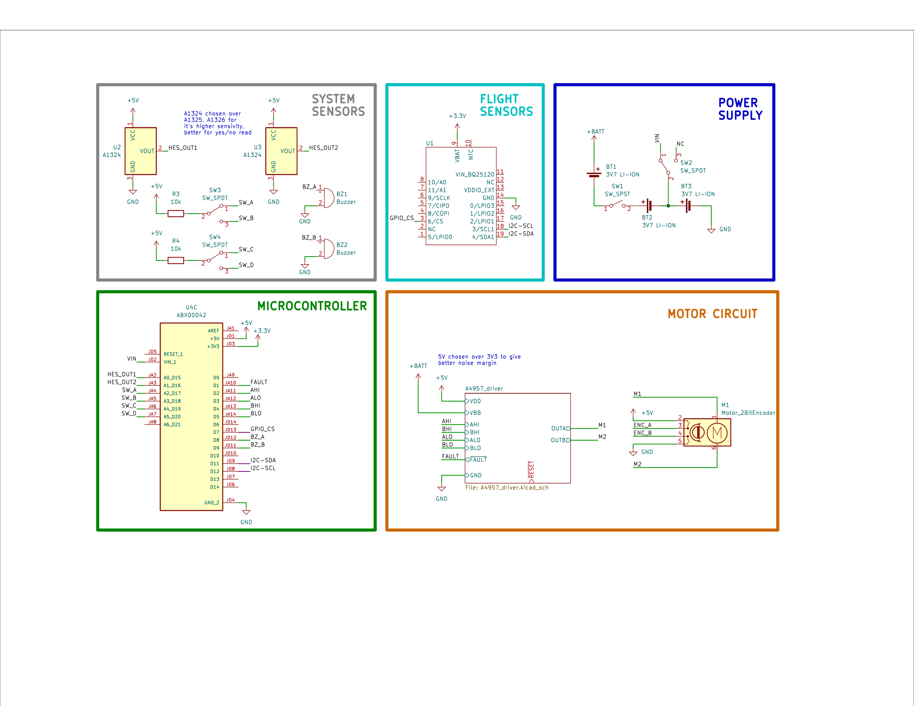

# Detailed Design

## Mechanical Design

After the transition to three flaps in January, the basic mechanical
design has remained largely unchanged, barring a few minor, yet
necessary, adjustments identified through the mechatronic model. The
initial modification involved adding washers at both ends of the lead
screw, addressing rough edges (burrs) left from the lathe-milling
process. To accommodate the lead screw\'s turned-down smooth shaft, and
ensure an effective interface with the bronze bearing, two precision
tolerance washers from McMaster-Carr were selected, as detailed in
Figure 13. Another revision was the development of a motor mount. The
integration of electronic components revealed the absence of a suitable
motor mounting solution on the top platform and lead screw. To solve
this, a component that attaches to the top platform was designed,
providing a robust mount for the motor and facilitating the coupler
connection to the lead screw, depicted in Figure 16.

The third modification entailed adding three \"platform spacers\" to
maintain the critical distance between the two platforms, which directly
influences the compression on the lead screw. Too little distance
results in binding due to the lead screw pressing against the platforms,
while too much distance introduces unwanted play in the mechanism. The
incorporation of these spacers, firmly secured with screws, ensures the
correct spacing is consistently maintained, highlighted in blue in
[]{.mark}Figure 14. This approach was deemed suitable as it had been
effectively tested in the 3D-printed mechatronic model and the
airbrake\'s weight budget comfortably accommodated the additional mass.

Initially, the correct spacing was to be achieved by first installing
the top platform, measuring the appropriate distance, then fitting the
remainder of the system. However, recognizing the potential for
variability in this method, it was decided to include platform spacers
to allow for one-piece installation, enhancing precision and
reliability.

Subsequent adjustments were made to the flap dimensions, following the
WE Rocketry Team\'s recommendation for slightly larger flaps. This
necessitated minor modifications to maintain the correct part
relationships, preserving the mechanism\'s fundamental operation as
established in previous iterations.

Finally, the integration of electronics prompted the addition of Hall
Effect sensors to determine the system\'s limits, requiring alterations
to accommodate sensor boards on the top and bottom platforms and the
installation of magnets on the lead nut. These changes, though minor,
were crucial for the precise functioning of the mechanism, illustrated
in Figure 15.

  ----------------------------------------------------------------------------------------------------------------------------------------------------
  {width="2.611408573928259in"   generated](./media/image17.png){width="2.4880949256342957in"
  height="2.1404636920384954in"}                                            height="2.1489063867016625in"}
  ------------------------------------------------------------------------- --------------------------------------------------------------------------

  ----------------------------------------------------------------------------------------------------------------------------------------------------

  : []{#_Ref163390546 .anchor}Figure 1: Rocket with airbrakes: surfaces
  controlled by a servomotor which can increase the longitudinal drag
  forces. The airbrakes are located behind the center of pressure to
  guarantee stability.

## Mechanical Material Selection

### 3D Printed Components

When looking at the materials selected there is an apparent strong
emphasis put on 3D-printed parts. This was a decision made with a
considerable amount of deliberation as 3D-printed materials are often
"unknown" or "lesser-known" in their specific performance factors.
Clearly this can make the accurate representation of materials in FEA
more complicated and can make the material validation process laborious
when compared to commonly used/studied materials (ex. Aluminum).

To briefly go over some of the factors considered when making this
important decision the first and likely most important is the background
research. Fortunately, since 3D-printing is a relatively new topic in
engineering it is being extensively studied and there is seemingly a
sufficient body of material to obtain a fair FEA material profile from.
Four studies were compared \[16\], \[17\], \[18\], \[19\] when
determining what values would initially be used for the PLA material
profile. After using the lowest values listed in these studies a
material profile was then constructed allowing for the start preliminary
FEA on the parts. Furthermore, it is well know that 3D-printed parts are
strong in compression, but weak in tension due to layer line adhesion
\[20\] (when the layer lines are normal to tensile direction).
Therefore, even when the preliminary FEA determined our parts were
strong enough, the precaution of layer orientation was also taken into
consideration to ensure that the parts were likely even stronger than
the FEA results would indicate.

Once the parts had been printed and assembled, they were subjected to
the expected loads of the airbrake system based on our simulation
results. The test showed that the 3D-printed parts would not deform
elastically or plastically under the expected loads and no obvious forms
of wear including damage or cracking were observed in the components.

The final factor taken into consideration is the opinion of the team's
faculty supervisor Dr. Makaran. Early on, when discussing material
selection Dr. Makaran was consulted for his opinion on using 3D-printed
parts in the design. Once Dr. Makaran was informed of the loads the
components would be subjected to, he too reassured the team that to his
knowledge 3D-printed parts would work, but he urged the team to still
continue investigating and to do the physical tests that were discussed
earlier.

### Carbon Fiber Parts

Since the early stages of the project the flaps were designed to be
carbon fiber mainly due to their strength and weight properties.
Initially the flaps were planned to be forged carbon fiber, manufactured
using a compression mold. However, after initial manufacturing testing
of this process it was determined that the process was too complex for
the scope of the project and the end result was not satisfactory. The
manufacturing testing results lead to the initialization of a material
re-selection process for the flaps.

After careful consideration, woven carbon fiber was chosen due to a
multitude of factors. Primarily, the team could cut the flaps out of
pre-manufactured tubes that the Rocketry team has, ensuring that the
curvature of the flap directly matches the tube it is mounted in.
Furthermore, since the rocketry team has been manufacturing these tubes
for many years the properties of the carbon fiber is well established
and the quality of the parts is sufficient. No other carbon fiber parts
were used as the manufacturing process is labour intensive and was
deemed to be unnecessary for the scope of this project and its use case.

### Off-the-Shelf Components

All purchased items were sourced from McMaster-Carr due to their large
selection and fast shipping times. All components purchased from
McMaster-Carr were specifically chosen to fit the needs of the project
while still attempting to be commonplace items, so as to reduce the
number of custom parts needing to be machined in the future. All
fasteners involved in the linkage mechanism were chosen due to their
"un-threaded" length which allowed for them to act as the hinges and
keep the design simple. Furthermore, low-profile barrel screws were
chosen for the lower hinge mechanism to maintain a similar hinging
methodology as the other fasteners, while having a low profile to
accommodate for the space constraints in this area.

The center lead screw was chosen after significant deliberation between
the mechanical and electrical systems to optimize the number of
rotations needed between the stowed position and fully deployed
position. Three options of TPI were assessed and the one found to be
most well suited for the project was the ¼-12 lead screw. This lead
screw was a fair balance between cost and travel per revolution. It was
determined that for this lead screw 25.38 revolutions would be needed as
the distance traveled by the lead nut is 2.10" and the TPI is ¼-12. A
requirement from electrical systems was that the revolutions be kept
below 28 and this TPI accomplished this. As mentioned previously, other
TPI's were considered including ¼-20 as it is an industry standard but
did not satisfy the \< 28 revolution requirement, and the ¼-8 TPI also
considered was too expensive to justify.

Two specific types of washers were purchased for this project. The first
was a high-tolerance machined washer, chosen to fit over the machined
section of our lead screw and provide a sacrificial interface between
the ends of the lead screw threads and the platform bushing. The second
type of washer chosen was a mil-spec thin washer. This washer was chosen
to provide a low-friction replaceable surface for the hinges to rub on,
while also eliminating the lateral play in the hinges that was
intentionally designed to accommodate for the fact that the parts were
going to be 3D-printed.

All other purchased components were minor components and were chosen to
be very common sizing (ex. ¼-20 bolts) as to not necessitate a
McMaster-Carr order but were added to the teams purchase order to
simplify our material purchasing process.

## Computational Fluid Dynamics (CFD)

CFD simulations are used in the design phase of the airbrakes system to
analyze and understand the complex aerodynamic behaviour and flow
patterns around the system. For the purposes of the Capstone project
deliverables, CFD studies were conducted on the rocket structure without
the airbrakes deployed. These preliminary studies were conducted for the
following reasons:

### Baseline Comparison

The CFD simulations without the airbrakes were used to establish a
baseline understanding of the aerodynamic behaviour of the rocket. This
baseline provides insight into the rocket's normal operational state
without the influence of the airbrakes. It provides a clear starting
point for comparison of the drag forces when airbrakes are later
introduced. Additionally, most of the drag force is produced by the
rocket rather than the airbrakes. Therefore, these studies provide a
good picture of the whole flight despite a precise prediction of the
drag induced by the airbrakes.

Through predicting the rocket's aerodynamic performance without
airbrakes, factors such as drag coefficients can be understood under
various operating conditions. These predictions serve as a reference for
evaluating how the introduction of airbrakes will impact overall vehicle
performance.

### Computational Efficiency

Conducting initial CFD simulations without the airbrakes allows the team
to streamline the computational process and optimize simulation
parameters such as mesh resolution, turbulence models, and boundary
conditions. This is important for reducing computational time and
resources for future complex simulations.

The CFD simulations performed used a mesh resolution of 0.05 mm and
inflation layers along the rocket's external structure to better resolve
the boundary layer. The boundary conditions included an inlet with a
specified velocity, a 0 Pa pressure outlet, and walls with specified
shear of 0 Pa to represent an infinite domain. The turbulence model used
was the k-omega shear stress transport because the flow around the
rocket is expected to separate at high velocities, and this turbulence
model is most accurate at simulating the detachment of the boundary
layer \[21\].

The results from the CFD simulations are currently preliminary. Future
CFD simulations are warranted to determine the influence of the
airbrakes on the drag forces. However, research indicates that the drag
induced by the airbrakes has been shown to be relatively decouplable
from the rest of the rocket's drag and many teams have determined that
airbrakes have a drag coefficient of 1.0 \[22\]. The custom simulator
uses this information presently as an input. The future CFD simulations
will provide updated values to be included in the custom flight
simulator.

## Flight Dynamics

Understanding of the flight dynamics informed many design decisions. Due
to the importance of accurately knowing how the rocket would perform
during flight and how airbrakes would alter the flightpath of the
rocket, several methods were used to analyze flight dynamics. Some of
the most important factors that influenced the design which can be
determined from an accurate representation of the flight dynamics are:

1.  A determination of the maximum g-force that the rocket -- and thus
    the airbrakes system -- is expected to be subjected to during
    flight.

2.  A determination of the aerodynamic pressures that airbrakes are
    expected to experience during flight.

3.  A projection of the maximum extent to which drag induced by the
    airbrakes system could change the rocket's apogee.

4.  An estimation of the maximum force that the airbrakes flaps would
    experience if they were to deploy as quickly and as early as
    possible.

### Custom Simulation

One key tool used to make design decisions, which is also used by the
airbrakes controller, is a custom-made flight simulator, coded by the
team in Python. The full simulation can be accessed on the team's
GitHub, and visualizations of the simulation results can be found in the
file visualizations.ipynb. Key figures for this report determined by the
simulation are shown below in Table 5:

  -----------------------------------------------------------------------
  Figure                                        Value
  --------------------------------------------- -------------------------
  Apogee without airbrakes deployment           11745 ft (3580 m)

  Apogee with maximum airbrakes deployment      9977 ft (3041 m)

  Maximum g-force                               13.58 g

  Max-q on rocket                               49.63 kPa

  Maximum force on a flap                       32.5 N
  -----------------------------------------------------------------------

  : []{#_Toc163515992 .anchor}Figure 2: ARAC model in fully closed state
  (left), Isometric view of ARAC model in max extension state (right).

In accordance with FR-002, the airbrakes as simulated can induce enough
drag to reduce the rocket's apogee to within 200 ft of its 10 000 ft
target to achieve our goal. Figure 17 and Figure 18 give a visualization
of how the simulated flightpaths differ between when airbrakes are not
deployed (Figure 17) versus when the airbrakes are deployed as fast as
they can be (and then remain fully deployed for the duration of the
flight, in Figure 18).

It should be noted that as of the publication of this report, the mass
budget of the rocket is in a state of flux as some final design
considerations are still being made by the rocketry team's various sub
teams, and some final parts are still being fabricated. Depending on
when this report is read, the most up-to-date version of the
aforementioned "visualizations.ipynb" may have updated values that are
different than those reported in the table and figures above.

### OpenRocket Simulations

OpenRocket simulations were conducted in collaboration with WE
Rocketry's propulsion sub team. Their results help validate the custom
flight simulation created by the airbrakes team. Several OpenRocket
simulations were performed on a range of different possible wind
conditions to get a more wholistic view of what conditions the rocket
might experience during flight. For the purposes of this report,
worst-case scenarios of the maximum g-force and max-q as reported in
Table 7 come from the OpenRocket simulation without any wind (as it is
with no wind that those parameters are at their largest).

### RocketPy Simulations

A further series of simulations were run using RocketPy, which released
an update allowing for airbrakes simulation in February. The values
obtained from the simulation align very well with those obtained from
the custom simulation and can be found in Table 7.

### Bounding Calculations

The absolute worst-case scenarios, assuming no parts of the rocket
unexpectedly come off, can be determined with simple calculations as
follows. These calculations are a good way to check if the values
determined using the methods in the previous sections are reasonable.

The maximum g-force that the rocket could experience (assuming it
remains intact during its ascent) is bounded by three parameters: the
motor's thrust curve, the rocket's mass, and the force of gravity.
Assuming there to be absolutely no drag is unrealistic, but doing so
provides a ceiling on the maximum possible g-force, that can
conveniently be determined in a few minutes according to Equation 1:

$$F_{g\ max} = \frac{F_{thrust\ max}}{m_{rocket\ dry} + m_{fuel}(t = t\left( F_{thrust\ max} \right))} - g$$

The inputs to Equation 1 are summarized below in Table 6:

  -----------------------------------------------------------------------
  Parameter                           Value
  ----------------------------------- -----------------------------------
  Maximum thrust force of the         2938 N
  Cesaroni 7450M2505-P motor \[23\]   

  Dry mass of the rocket              17.963 kg

  Mass of fuel remaining in the       1.982 kg
  Cesaroni 7450M2505-P motor at the   
  time of maximum thrust (1.2s)       
  \[23\]                              
  -----------------------------------------------------------------------

  : []{#_Toc163515993 .anchor}Figure 3: Underside view of ARAC system
  near max extension; linkage mechanism identified.

Given the values in Table 6, Equation 1 yields a maximum g-force on the
rocket of 14.02 g.

Similarly to how an upper bound on the max-g force was calculated, an
upper bound on max-q can be calculated assuming no drag to help validate
the results of the simulations. Once again, it is an upper bound that,
given the rocket's parameters and that it does not fall apart during
ascent, cannot physically be reached. The upper bound can be calculated
by first finding the maximum velocity which the rocket can attain if it
didn't experience any drag, using Equation 2:

$$v_{\max} = \max\left( \int_{0}^{t}{\left( \frac{F_{thrust}\ (t)}{m(t)} - 9.81\frac{m}{s^{2}} \right)\ } \right)$$

Where the t in the integral ranges from 0 to the time of motor burnout.

Using the thrust curve and fuel burn rate of the Cesaroni 7450M2505-P
motor \[23\] and the dry mass of the rocket (as reported in Table 6),
the maximum velocity the rocket could theoretically attain is 342.1 m/s.
Using this value and taking the worst-case value for air density as the
air density at the launchpad (0.98 kg/m^3^)[^1], an upper bound for the
aerodynamic pressure that the rocket cannot physically reach can be
calculated using Equation 3:

$$q = \frac{1}{2}*\rho*v^{2}$$

Plugging in the aforementioned values into Equation 3 gives an upper
bound on the aerodynamic pressure of 57.34 kPa.

### Summary and Comparisons

The results of the different simulations and bounding calculations are
well-aligned. Comparisons of the four methods are summarized below in
Table 7:

  ----------------------------------------------------------------------------
  Method         Maximum   Max-q (kPa)  Apogee - no        Apogee - max
                 g-force                airbrakes          airbrakes
                 (g)                    deployment (ft)    deployment (ft)
  -------------- --------- ------------ ------------------ -------------------
  Custom         13.58     49.63        11745              9977
  Simulator                                                

  OpenRocket (no 13.47     47.00        10469              \-
  wind)                                                    

  RocketPy (no   13.56     53.8         11880              10078
  wind)                                                    

  Bounding       14.02     57.34        \-                 \-
  Calculations                                             
  ----------------------------------------------------------------------------

  : []{#_Toc148736783 .anchor}Figure 4: EULER full-body CFD: pressure at
  Ma 1.2.

### Stopping Power Analysis

To determine the size of flaps that would be necessary to provide enough
stopping power to bring the rocket's final apogee down to 10 000 ft, a
sensitivity analysis was conducted using the custom flight simulator.
The analysis considered what the simulated apogee would be at different
deployment speeds and with different flap sizes, assuming that the
airbrakes deployed to their full deployment angle as fast as possible
and remained fully deployed for the duration of the flight (giving the
maximum possible drag that airbrakes with that specific deployment speed
and flap size could produce).

## Electrical Design

The electrical design presented herein is scoped into two versions or
phases of development to align with the stakeholders' requirements. The
first phase is the completed Functional Prototype (FP) to enable the
validation and verification of the overall system design and will hence
be flight-ready, but non-optimized. The second phase is the Production
Prototype (PP) which is focused on refining the design for
manufacturability and efficiency, transitioning from a functional
prototype to a streamlined version suitable for limited production runs
by future teams as they iterate and improve upon the design. This second
phase includes developing a custom Printed Circuit Board (PCB) and
redesigning certain components initially sourced as off-the-shelf
modules to create an integrated solution that aligns with industry
standards.

### System Overview

The electrical system consists of five major parts: 1) the
microcontroller development board, 2) the motion and environment sensor
array, 3) the motor circuit, 4) system sensors, and 5) the power supply.
The sensor array obtains information on the motion of the rocket and its
external environment which is read by the microcontroller along with
information obtained from the system sensors on the internal state of
the mechanism to determine actuation of the motor circuit. The FP
electrical schematic is shown in Figure 20 with the major parts
indicated. Individual figures for each of the blocks are given in
Appendix II for easier in-depth viewing.

### Load Analysis & Motor Selection

This method and results of this analysis section can be accessed on the
team's GitHub
([link](https://github.com/chasgior214/airbrakes-capstone/tree/main)).
The force-torque analysis began with converting the mechanical geometric
of the leadscrew push-rod mechanism into a static mechanical model.
Figure 21 displays a stripped down and highlighted version of the
mechanical model to only show the essential components of the problem.

The simplicity of the mechanism allowed it to be readily converted into
a simple two-force member model diagram in which to solve, shown in
Figure 22. The force in the model is applied normally as it represents
the equivalent aerodynamic load considering the deployment angle, that
is, sine of theta. The aerodynamic load considered was a
worse-case-scenario of the highest of the calculated q-max values (56.21
kPa) at full deployment (41.35°). It is directed at the midpoint of
member CD since it assumes an even distribution of force across the
length.

  -----------------------------------------------------------------------------------------------------------------------------------------------------
  {width="3.2395833333333335in"   generated](./media/image25.png){width="1.4919674103237095in"
  height="1.596392169728784in"}                                              height="1.5958333333333334in"}
  -------------------------------------------------------------------------- --------------------------------------------------------------------------

  -----------------------------------------------------------------------------------------------------------------------------------------------------

  : []{#_Toc148736784 .anchor}Figure 5: EULER full-body CFD: fin
  interaction.

The force can be decomposed into its components using the known theta
angle, this force will be equally shared between the two pins and then
the force can be simply passed along the members assuming static
equilibrium. As shown in Figure 22 the forces being exerted by the lead
screw nut on the push rods is down and inwards as expected. Python was
used as the numerical solver for the analysis which also included a
factor of safety for uncertainties and inefficiencies such as friction
and imperfections. The resultant forces based on the described analysis
yielded -59.28 N in the x-coordinate and -23.95 N in the y-coordinate.

The efficiency of the lead screw was calculated using a python script
which took into account the physical and material characteristics of the
screw and nut assembly based on the manufacturer provided
specifications. The pitch diameter is assumed to be approximately equal
to the nominal diameter of the screw. Subsequently, the lead angle is
determined using the formula:

$Lead\ Angle = \ \tan^{- 1}\frac{Lead}{\pi\  \times Pitch\ Diameter}$
(5)

which assesses the angle made by the thread\'s helical rise relative to
the screw axis. The angle of friction, dependent on the materials\'
coefficient of friction, is calculated using:

$Angle\ of\ Friction = \ \tan^{- 1}{(Coefficient\ of\ Friction)}$ (6)

The final step involves computing the efficiency of the lead screw,
which is a measure of the mechanical advantage versus the energy lost
due to friction. This is done using the formula:

$Efficiency = \ \frac{tan(Lead\ Angle)}{tan(Lead\ Angle + Angle\ of\ Friction)}$
(7)

​The efficiency result was 22.13%, which falls within the expected range
for the Forward Drive Efficiency of an Acme Lead Screw for the given
dimensions \[24\].

The efficiency of a lead screw, previously calculated, was applied
alongside the expected load from a static mechanics model to determine
the load torques for both driving and holding. For the driving torque,
the equation is given by:

$Driving\ Torque = \ \frac{Load\  \times Lead}{2\pi\  \times Efficiency}$
(8)

This calculation involves the load (in pounds), the screw lead (in
inches per turn), and the screw\'s efficiency, with the torque expressed
in pound-inches. The holding torque, indicative of the force needed to
keep the load stationary, is derived using the equation:

$Holding\ Torque = \ \frac{Load\  \times Lead \times Efficiency}{2\pi\ }$
(9)

The resulting maximum required driving torque is 1.14 kg-cm and the
required holding torque is 0.08 kg-cm. Going forward into the motor
selection the required driving torque was used to continue tending to
the worse-case-scenario.

To evaluate the required torque of the expected scenario, the force
profile obtained in the flight dynamics analysis is fed into the
load-torque analysis to obtain the torque curve seen in Figure 23Figure
23. Based on the required number of rotations required for the
deployment of the mechanism (25.38 rotations) and the estimated
deployment time from the flight dynamics analysis (8.18 seconds) the
required speed can be calculated to be approximately 186 RPM. In
preparation for motor selection additional calculations were written to
obtain the motor requirements in various units and conventions to aid in
components sourcing and are included in the analysis script.

Based on the given requirements a 20mm 12V Planetary Gearmotor with an
Encoder was selected, the specifications of which are in Table 8.

  -----------------------------------------------------------------------------
  **Component**   **Dimension/Specification**   **Value/Description**
  --------------- ----------------------------- -------------------------------
  *Gearbox*       Diameter x Length             20D x 21.5L mm

  *Motor*         Diameter x Height x Length    20D x 14H x 32L mm

  *Shaft*         Diameter x Length, Shape      4D x 10.5L mm, D-shaped

  *Encoder*       Type, channel number, pulses  Magnetic encoder, 2 channels,
                  per rotation                  11PPR

  *Model*                                       20PG-180SH-29-EN 12V

  *Electrical*    Voltage                       12V DC

                  Reduction Ratio               1:29

                  No-load Speed                 515 RPM

                  No-load Current               \< 280 mA

                  Rated Torque                  0.65 kg.cm

                  Rated Speed                   445 RPM

                  Rated Current                 \< 550 mA

                  Stall Torque                  \> 3 Kg.cm

                  Stall Current                 \< 2.7 A
  -----------------------------------------------------------------------------

  : []{#_Toc148736785 .anchor}Figure 6: The ThrustMIT Airbrake system in
  both the stowed and deployed positions.

The selection of a brushed DC motor for the project was guided by
several critical design requirements. Firstly, the application\'s need
for unconstrained rotation eliminated servo motors, which are typically
limited in their rotation capabilities. Additionally, the project\'s
stringent mass constraints necessitated a motor with a high-power
density, ruling out stepper motors due to their generally lower
power-to-weight ratio. Furthermore, the project\'s specific electrical
complexity and performance requirements deemed brushless DC (BLDC)
motors excessive for the intended application. Consequently, a brushed
DC motor, augmented with a gearhead, was identified as the optimal
choice. The gearhead effectively adjusts the motor\'s torque and speed
characteristics to align with the expected load conditions. Moreover,
the integration of an encoder enables precise closed-loop feedback on
the mechanism\'s position, ensuring the desired level of control and
performance.

The specific motor selected meets the system requirements as it will be
operating in the 10-30% range (\~0.15 kg-cm operating to 0.65 kg-cm
rated) of the rated torque which will place the required speed firmly
within the acceptable range for pulse-width modulation control (155 RPM
operating to 445 rated).

### Motor Driver Circuit

The motor circuit consists of the selected brushed DC motor driven by
the L298N full bridge breakout module. This was selected as it is widely
used and available and supports the voltage rating of the selected 12V
motor and satisfies the current maximum requirements. The L298N motor
driver IC is a dual full bridge driver that is designed to drive
inductive loads such as relays, solenoids, DC and stepping motors by
allowing control of both speed and direction with high voltage and
current up to 46V and 2A per channel under continuous operation and up
to 3A for intermittent operation, featuring built-in diode protection
against back-EMF. As per the product datasheet, the outputs can be
paralleled for higher current output by according to Figure 25,
equivalent parallel pairs are given in for clarity.

  -----------------------------------------------------------------------
  **Full Bridge A**                   **Full Bridge B**
  ----------------------------------- -----------------------------------
  IN1                                 IN4

  IN2                                 IN3

  OUT1                                OUT4

  OUT2                                OUT3

  ENA                                 ENB
  -----------------------------------------------------------------------

  : []{#_Toc163515997 .anchor}Figure 7: The retracted (left) and
  deployed (right) CAD renderings of the airbrakes mechanism used by
  ARIS in 2018.

### Flight Sensors

For the flight sensors, the Arduino Pro Nicla Sense ME development board
was chosen due to its comprehensive integration of critical sensors
necessary for monitoring motion and environmental conditions during
flight. This board features various sensors for motion and environment
sensing, all from Bosch known for their high performance and accuracy.
The selection of the Nicla Sense ME allows for a streamlined system
architecture by consolidating multiple sensors onto a single board,
which simplifies the design and enhances the reliability of data
collection for flight dynamics analysis. A summary of the sensors and
their contextual applications is given in Table 10: Arduino Pro Nicla
Sense Motion and Environment Sensors and Contextual Applications.

  -----------------------------------------------------------------------------
  **Sensor Type** **Part**   **Description**                 **Context**
  --------------- ---------- ------------------------------- ------------------
  Accelerometer   BHI260AP   3-axis, part of an integrated   Detecting and
                             sensor hub with AI capabilities analyzing motion
                             for motion detection.           patterns.

  Gyroscope       BHI260AP   3-axis, integrated within       Orientation
                             BHI260AP for orientation and    tracking and
                             motion tracking.                motion correction.

  Pressure        BMP390     Operates between 300 - 1250 hPa Altitude and
                             with high accuracy and low      atmospheric
                             drift for atmospheric           pressure data.
                             measurements.                   

  Magnetometer    BMM150     Measures magnetic fields within Orientation to
                             ±1300μT in X,Y axes and ±2500μT Earth\'s magnetic
                             in Z axis with low noise.       field, used for
                                                             header correction.

  Humidity        BME688     Measures relative humidity as   Unused. Potential
                             part of environmental sensing   future use in
                             capabilities.                   assessing launch
                                                             site conditions.

  Temperature     BME688     Accurate temperature            Unused. Potential
                             measurement as part of the      future use in
                             environmental sensor suite.     assessing launch
                                                             site conditions.

  Gas/VOCs        BME688     Detects a wide range of gases   Unused. Potential
                             including VOCs for air quality  future use in
                             assessment.                     assessing launch
                                                             site conditions.
  -----------------------------------------------------------------------------

  : []{#_Toc163515998 .anchor}Figure 8: Diagrammatic visual of Avionics
  Control Schematic from the University of Ottawa Student Team of
  Aeronautics and Rocketry airbrakes in 2018.

### System Sensors

The System Sensors module encompasses a variety of components designed
to ensure the smooth operation and safety of the mechanism. This
includes the Hall Effect magnetic switches, utilized as end stops to
accurately determine the mechanism\'s extreme positions independently of
the encoder, slider switches for user input, and piezo buzzers for
auditory feedback.

The hall effect sensors were chosen for their simplicity and efficacy as
magnetic switches, acting as critical components for demarcating the
mechanism\'s upper and lower limits. The specific part was selected as
it was on-hand, is 5V compatible, and met space constraints.

The input switches and piezo buzzers are used for preflight programming
if the wireless connection to the MCU fails or is unreliable at the
launch site. It\'s important to note that while piezo buzzers serve as
auditory indicators rather than sensors, they are grouped in this
section for organizational clarity. Auditory indication was selected
over visual indication such as a light due to the difficulty in
predicting where it will be visible post-integration with the rocket.
The piezo buzzers are differentiated by their frequencies to convey
distinct types of feedback: a 2.5 kHz buzzer emits a lower-pitched, less
intrusive sound for confirming actions, while a 4 kHz buzzer produces a
higher-pitched tone designed to capture attention for alerts and
warnings. The chosen buzzers are 5V compatible and have a low profile to
accommodate the spatial constraints. The right-angle mounting design of
the selected input switches facilitates easy access from outside the
rocket, allowing for pre-flight programming through four possible binary
input combinations.

### Microcontroller

At the heart of the system is the Arduino Portenta H7, chosen for its
dual-core architecture combining a high-performance ARM Cortex-M7 and an
energy-efficient Cortex-M4 as part of the STM32H747XI. This enables the
parallel execution of computationally intensive flight computer
algorithms alongside the real-time mechanism control tasks. The
Cortex-M7 core runs at 480 MHz, while the Cortex-M4 core operates at 240
MHz, providing a powerful platform for multitasking. Additionally, the
board is equipped with significant memory resources, including SRAM and
flash memory, to support complex applications and data storage
requirements of this mission critical system.

Ease of programming and futureproofing were a significant factor in this
selection due to board\'s compatibility with high-level Arduino
sketches, allowing for quick development cycles and straightforward
modifications by subsequent teams. Its direct compatibility with the
Nicla Sense ME sensor board facilitates seamless integration, making the
Arduino Portenta H7 an optimal choice for managing the demanding
requirements of both the flight computer and mechanism controller,
leveraging its substantial processing power and versatile development
environment for efficient system performance.

### Power Supply

The power supply for the project relies on Lithium-ion (Li-ion)
batteries, selected for their high energy density and efficiency. The
choice of Li-ion batteries was heavily influenced by competition rules
that explicitly ban the use of Lithium Polymer (LiPo) batteries \[4\]
and our research showed that this is a common alternative used in the
SAC competition. In selection of the battery cells the capacity, max
discharge rate, and voltage requirements were considered. The power
consumption ratings for each of the relevant components is given in
Table 11.

+----------------------+-----------------------+-----------------------+
| **Component**        | **Electrical Power**  | **Details**           |
+======================+=======================+=======================+
| Portenta H7          | 2.6 mA @ 3.7V         | Current consumption   |
|                      |                       | in busy loop (@5V)    |
|                      |                       | \[max with on board   |
|                      |                       | LEDs off\].           |
+----------------------+-----------------------+-----------------------+
| Nicla Sense ME       | 2.5 mA @ 3.7V         | Power consumption     |
|                      |                       | advertising with      |
|                      |                       | sensor polling at 1Hz |
|                      |                       | \[max consumption     |
|                      |                       | state\].              |
+----------------------+-----------------------+-----------------------+
| L298N Motor Driver   | 4 mA @ 12V            | Quiescent supply &    |
| (V~EN~=L)            |                       | VSS current of        |
|                      | 6mA @ 5V              | inactive driver \[max |
|                      |                       | value of range        |
|                      |                       | taken\].              |
+----------------------+-----------------------+-----------------------+
| L298N Motor Driver   | 22 mA @ 12V           | Quiescent supply &    |
| (V~EN~=H)            |                       | VSS current of active |
|                      | 36 mA @ 12V           | driver \[max value of |
|                      |                       | range taken\].        |
+----------------------+-----------------------+-----------------------+
| Brushed DC Motor     | 5000 mA @ 12V         | Stall current of the  |
|                      |                       | selected motor.       |
+----------------------+-----------------------+-----------------------+
| Hall Effect Sensor   | 6.9 mA @ 5V           | Supply current of the |
|                      |                       | IC.                   |
+----------------------+-----------------------+-----------------------+

: []{#_Toc163515999 .anchor}Figure 9: Pancake Airbrakes.

To calculate the required capacity, the 20-hour required standby time
given in ER-003 and an active motor time of 10 seconds (approximately a
FOS of double the predicted motor action time. This yields a total
required capacity of approximately 400 mAh, the calculations are broken
down in Table 12. The datasheet for the Arduino Portenta recommends a
greater minimum of 700 mAh for battery powered use and this will hence
be used as the single cell minimum herein.

  ----------------------------------------------------------------------------------
  **Phase**    **Component**       **Current   **Voltage   **Active   **Energy
                                   (mA)**      (V)**       Time**     Required
                                                                      (mAh)**
  ------------ ------------------- ----------- ----------- ---------- --------------
  Standby      Portenta H7         2.6         3.7         20h        52

               Nicla Sense ME      2.5         3.7         20h        50

               L298N Motor Driver  6           5           20h        120

               Hall Effect Sensor  6.9         5           20h        138

  Standby                                                             360
  Subtotal                                                            

  Active       Brushed DC Motor    5000        12          20s        27.78

               L298N Motor Driver  36          12          20s        0.2
               (Active)                                               

  Active                                                              27.98
  Subtotal                                                            

  *Total                                                              387.98
  Required                                                            
  Energy*                                                             
  ----------------------------------------------------------------------------------

  : []{#_Toc163516000 .anchor}Figure 10: Flap Airbrakes.

The MCU board is supplied with by a single 3.7V cell which the onboard
regulator regulates to 5V to power the 5V components. The DC motor is
rated at 12V therefore 3 cells are required to reach the required
potential which results in a nominal 11.1V (within 10%). As the cells
will be wired in a 3 series (3S) configuration each must independently
be capable of supplying the maximum current of the motor, that is 5000
mA which sets the required minimum discharge current.

This gives a selection criterion of three cells rated at least 700 mAh
each with a minimum discharge rate of 5000 mA. The Panasonic NCR18650GA
3450mAh 10A Battery was chosen for this application as it meets and
exceeds these required specifications while remaining well within
budget. It\'s important to note that most modern lithium-ion cells, even
those that are more affordably priced, meet or exceed the required
specifications for this project making the exact product selection
rather arbitrary. Therefore, the specific selection of the product was
primarily driven by the reputable brand name, price point, and supplier
accessibility. The power to the microcontroller uses the same model of
low-power switch as for the user input and the power switch to enable
power to the motor circuit is a power switched rated up to 6A.

### Development: Full Bridge MOSFET Motor Driver Circuit

The development of a MOSFET full-bridge motor driver circuit was
undertaken. This part is presented as-is and under development which
still requires further validation and verification. Herein, this motor
driver will be referred to as the discrete motor driver. The schematic
for the Production Prototype circuit is given in Figure 26 which
incorporates the discrete motor driver shown in Figure 27. The discrete
motor driver is based on the Allegro A4957 Full Bridge MOSFET Driver
which drives four Nexperia PSMN1R0-30YLC 30V N-Channel MOSFET Power SO8
package. The circuit layout and calculation of passive components
follows closely from the manufacturer datasheet application notes for
the A4957 driver chip. This development was undertaken as it offered the
following advantages it provides over an integrated component such as
the L298N.

Firstly, the discrete motor driver configuration exhibits higher
efficiency due to the A4957 and MOSFETs\' lower on-resistance,
minimizing power losses as heat. Secondly, this setup improves heat
dissipation capabilities as MOSFETs can efficiently spread-out heat over
a larger area compared to integrated circuits; this allows the system to
manage higher currents with less overheating, reducing the reliance on
extensive heat sinking measures that are undesirable in
space-constrained applications such as the present. Additionally, the
use of discrete components results in a more compact and lightweight
solution, again crucial for such applications where space and weight
constraints are important. The performance of motor control is also
enhanced, with better speed and torque management due to the efficient
handling of higher currents and faster switching capabilities of the
MOSFETs. Moreover, this design approach offers greater flexibility,
enabling customization to meet specific requirements more effectively.
Lastly, the discrete motor driver can handle higher voltage and current
levels than the L298N, broadening the range of compatible motors if
future iterations require upsizing of the motor.

### Development: Printed Circuit Board 

The development of a printed circuit board to correspond to the PP
circuit presented above is here presented as-is and under development as
it still requires further validation and verification. The printed
circuit board layout in the editor is displayed in []{.mark}Figure 28.
The discrete motor driver section aligns with the specific routing
patterns and fill plane placement outlined by the manufacturer to reduce
noise, aid thermal management, and optimize layout efficiency.

## Software Design

The overall software design consists of three distinct programs running
in parallel: 1) the flight computer, 2) the actuation controller, and 3)
the sensor client application. The flowchart diagram showing the core

### Flight Computer

The flight computer software serves to track the flight of the rocket in
order to inform the actuator controller of its required action to
achieve the desired drag modulation to reach apogee. The flight computer
is a customized version of the HPR-Rocket-Flight-Computer found on
GitHub, created by a registered rocketeer \[26\]. The core of the
program has been developed, however still requires significant
development and testing before flight due to the extensive size and
complexity of the program which contains nearly 10,000 lines of code. An
example of the main loop for the program is included in Appendix III for
brevity and due to the incomplete nature of the entire program. An
important aspect of the software design is the usage of strict data
structures for transporting sensor data and system events in an
organized and structured manner. All relevant program data is
initialized and continuously updated to non-volatile memory of the MCU
such that in the event of a controller reset, the previous state can be
quickly recovered through the rapid recovery routine.

The estimation of the rocket's real-time altitude and vertical motion is
achieved using a two-step Kalman/Complementary filter. A paper by Jung
Keun Lee in 2016 outlines the algorithm which was subsequently
translated into English and implemented as an Arduino library,
AltitudeEstimation \[27\]. The two-step Kalman/Complementary filter for
estimating vertical position with an IMU-Barometer system combines the
high-frequency, noisy acceleration data from the Inertial Measurement
Unit (IMU) with the more stable but lower-frequency altitude
measurements from the barometer. Initially, the Kalman Filter integrates
both data sources to correct the IMU's drift by weighing their
reliability, providing an optimized estimate of vertical position.
Subsequently, a complementary filter refines this estimate by balancing
the IMU's short-term accuracy against the barometer's long-term
stability, effectively minimizing temporary errors and response lag.
This dual-filter approach thus achieves accurate vertical positioning by
harnessing the strengths of both sensors, crucial for applications
requiring precise altitude control \[28\].

Once the flight computer algorithm detects that the rocket has exited
the boost phase and has entered the coast phase, it takes the current
state (i.e. current velocity and altitude) and compares it against a
lookup table generated from simulations. It selects the path from the
lookup table that most closely matches and sends the corresponding
deployment angle to the actuation controller running on the other core.

### Actuation Controller

The actuation controller consists of a closed feedback loop between the
desired position and the current position returned by the encoder. To
achieve this, a library was developed based on a legacy library \[29\]
inspired by AccelStepper library by Adafruit \[30\] and uses both the
Encoder library \[31\] and PID library \[32\] available in the Arduino
library manager. The header and main C++ file for the library can be
found in Appendices IV & V. Additional examples and scripts were created
to test the feedback of the encoder, tune the PID action, and configure
preset distances \[33\].

### Sense Client App

The client application that runs on the Nicla Sense ME is an unaltered
version provided by the manufacturer to set the device to act as a
client device and is given in Appendix VI.

## References

\[16\] J. Bochnia, M. Blasiak, and T. Kozior, "A Comparative Study of
the Mechanical Properties of FDM 3D Prints Made of PLA and Carbon
Fiber-Reinforced PLA for Thin-Walled Applications," *Materials (Basel)*,
vol. 14, no. 22, p. 7062, Nov. 2021, doi: 10.3390/ma14227062.

\[17\] J. A. Travieso-Rodriguez, R. Jerez-Mesa, J. Llumà, O.
Traver-Ramos, G. Gomez-Gras, and J. J. Roa Rovira, "Mechanical
Properties of 3D-Printing Polylactic Acid Parts subjected to Bending
Stress and Fatigue Testing," *Materials (Basel)*, vol. 12, no. 23, p.
3859, Nov. 2019, doi: 10.3390/ma12233859.

\[18\] A. Kholil, E. Asyaefudin, N. Pinto, and S. Syaripuddin,
"Compression Strength Characteristics of ABS and PLA Materials Affected
by Layer Thickness on FDM," *J. Phys.: Conf. Ser.*, vol. 2377, no. 1, p.
012008, Nov. 2022, doi: 10.1088/1742-6596/2377/1/012008.

\[19\] "Polymers \| Free Full-Text \| Strength of PLA Components
Fabricated with Fused Deposition Technology Using a Desktop 3D Printer
as a Function of Geometrical Parameters of the Process." Accessed: Apr.
07, 2024. \[Online\]. Available: https://www.mdpi.com/2073-4360/10/3/313

\[20\] E. A. Syaefudin, A. Kholil, M. Hakim, D. A. Wulandari, Riyadi,
and E. Murtinugraha, "The effect of orientation on tensile strength 3D
printing with ABS and PLA materials," *J. Phys.: Conf. Ser.*, vol. 2596,
no. 1, p. 012002, Sep. 2023, doi: 10.1088/1742-6596/2596/1/012002.

\[21\] "Zonal Two Equation k-w Turbulence Models For Aerodynamic Flows
\| Fluid Dynamics and Co-located Conferences." Accessed: Apr. 08, 2024.
\[Online\]. Available: https://arc.aiaa.org/doi/10.2514/6.1993-2906

\[22\]
"Team_127_Project_Technical_Report_to_the_2023_Spaceport_America_Cup.pdf -
Google Drive." Accessed: Apr. 08, 2024. \[Online\]. Available:
https://drive.google.com/file/d/18ZheeMO8H3UuRlllgGhdWLznT8SM7l4D/view

\[23\] "7450M2505-P Data (RockSim) • ThrustCurve." Accessed: Apr. 08,
2024. \[Online\]. Available:
https://www.thrustcurve.org/simfiles/5f4294d20002e900000005a0/

\[24\] R. Products, I. \| 645 E. E. Ave, Kirkwood, I. A. rights reserved
\|Lead Time, and I. I. \|Return Policy, "Acme Lead Screws & Nuts -
Engineering Data \| Roton Products Inc.," Roton Products, Inc. Accessed:
Jan. 19, 2024. \[Online\]. Available:
https://www.roton.com/products/acme-lead-screws-nuts/engineering-data/

\[25\] STElectronics, "Dual full-bridge driver Datasheet DS0218 - Rev
5." ST Electronics, Oct. 2023. \[Online\]. Available:
https://www.st.com/resource/en/datasheet/l298.pdf

\[26\] SparkyVT, "SparkyVT/HPR-Rocket-Flight-Computer." Apr. 06, 2024.
Accessed: Apr. 08, 2024. \[Online\]. Available:
https://github.com/SparkyVT/HPR-Rocket-Flight-Computer

\[27\] "juangallostra/AltitudeEstimation: A two-step
Kalman/Complementary filter for Estimation of Vertical Position using an
IMU-Barometer sytem." Accessed: Apr. 08, 2024. \[Online\]. Available:
https://github.com/juangallostra/AltitudeEstimation

\[28\] S. D. Levy, "simondlevy/TwoStepFilter." Apr. 04, 2024. Accessed:
Apr. 08, 2024. \[Online\]. Available:
https://github.com/simondlevy/TwoStepFilter

\[29\] "julester23/DCMotorServo: Arduino Library for controlling DC
motors with rotary encoders." Accessed: Apr. 08, 2024. \[Online\].
Available: https://github.com/julester23/DCMotorServo

\[30\] "adafruit/AccelStepper." Adafruit Industries, Mar. 08, 2024.
Accessed: Apr. 08, 2024. \[Online\]. Available:
https://github.com/adafruit/AccelStepper

\[31\] P. Stoffregen, "PaulStoffregen/Encoder." Mar. 30, 2024. Accessed:
Apr. 08, 2024. \[Online\]. Available:
https://github.com/PaulStoffregen/Encoder

\[32\] br3ttb, "br3ttb/Arduino-PID-Library." Apr. 08, 2024. Accessed:
Apr. 08, 2024. \[Online\]. Available:
https://github.com/br3ttb/Arduino-PID-Library

\[33\] "CameronBrooks11/DCMotorServo: An Arduino Library for controlling
DC motors with rotary encoders." Accessed: Apr. 08, 2024. \[Online\].
Available: https://github.com/CameronBrooks11/DCMotorServo