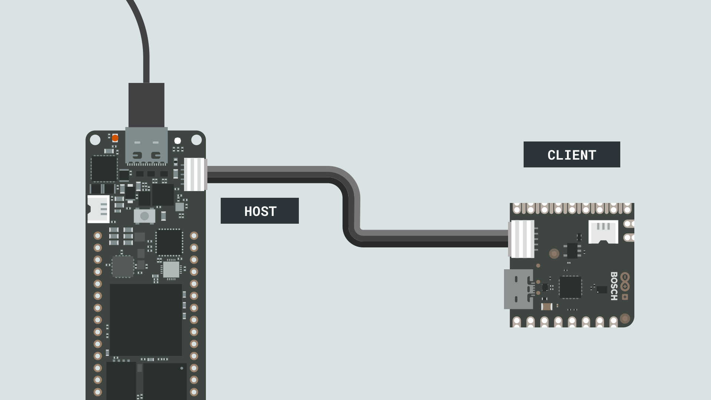
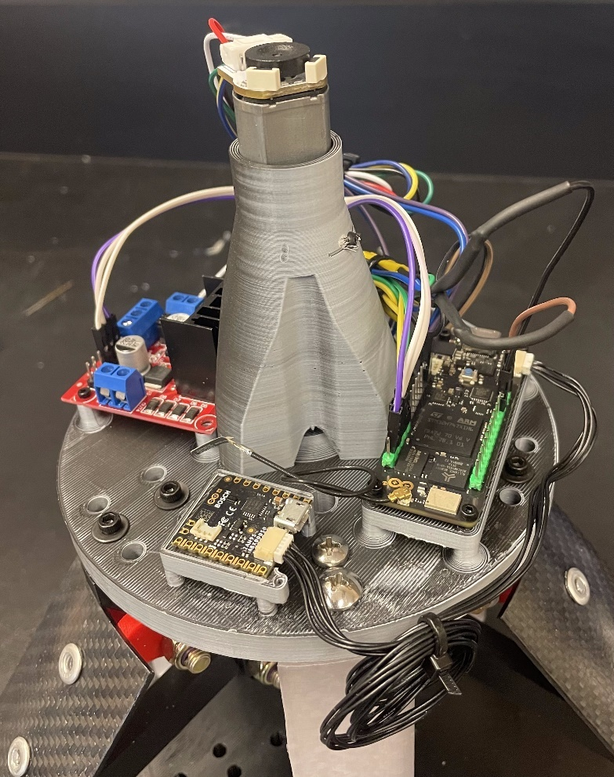

# Production Planning

## Mechanical Prototype Development

For the entirety of the first semester all design choices were made
assuming four flaps were being used. Unfortunately, soon after the
Christmas break and in early January the rocketry team changed from four
fins on the rocket to three fins which necessitated a change to three
flaps from the original four. This initially was not deemed as creating
a significant change for the airbrake team by the rocketry team however
once it was further investigated this was not the case. Due to this
change the entire design of the airbrake system had to be re-done from
the ground up starting with all new part files without a single part
being transferrable to the new three flap design. Clearly this had a
large impact on the timeline and prototyping process as many of the
deadlines needed to be pushed to accommodate this change. Evidently, the
prototyping phase became much more condensed than was originally
intended, causing significant added stress to team members. Fortunately,
the team was able to adjust to these changes and the prototype was
completed in time.

Due to the use of 3D-printed parts in the assembly it allowed for rapid
prototyping and the quick adjustments necessary to get the prototype
completed in time. The only issues that occurred with 3D-printing were
differences in print quality between various printers being used. This
issue can be easily solved with the use of a single printer, however
since the prototype phase was condensed from the design change multiple
printers were needed to allow for sufficient part down-time.

One significant hurdle faced in the assembly of the prototype was the
integration between the electrical and mechanical systems. Originally
the top plate had no mounting surfaces for any electronics, including
the motor itself. This obviously became an issue once the two systems
needed to be mounted together. It was eventually decided that the best
option was to add 3-D printed standoffs for the components right into
the design of the top plate. This type of design is only possible with
3D-printing and was a significant advantage of the use of 3D-printed
parts in the design. Furthermore, once all of the electrical components
had arrived, the design was modified to match the exact dimensions
necessary to fit all the components. Such easy customization is only
possible with 3D-printed parts and allowed for the integration between
the electrical and mechanical systems to relatively painless.

## Electrical Prototype Development

Due to the two phased approach taken in the electrical design, much of
the electrical prototyping was done using discrete modules connected
using wires to achieve the realized functional prototype. The initial
prototyping of the electrical system experienced delays due to the
analysis and selection of the motor taking longer than expected. Due to
this, the electrical prototyping and subsequent software development
took a route of parallel development between the flight computer aspects
and the mechanism controller aspects.

Due to the selection of the MCU and flight sensor array, the electrical
prototyping was extremely simple, using the provided cable to connect
the two via Inter-Integrated Circuit serial communication (I2C). Arduino
refers to this as the ESLOV connector in their internal documentation
and allows devices to be connected and act as host and client devices as
seen in Figure 30.

The remainder of the prototyping for the motor circuit and system
sensors consisted of the connection of the various components according
to the given schematic. Header pin connections were used for modules
with header pins and the motor used the provided cable which was fitted
with header connections to connect to the controller board. The power
lines were splices and wrapped together and heat shrink wrapped. A top
view of the mounted electrical prototype is shown in Figure 31, any
manufacturer-provided cables have been kept unaltered at full length to
preserve them until final wiring at the time of integration.

## Software Prototype Development

Following in line with the electrical prototyping, software prototype
development was split into two main parallel objectives, the flight
computer and the mechanism controller. Development of the flight
computer began with the testing of the flight sensors to read and
interpret the data. The first challenge with this was that the
documentation indicated that the class of data (Sensor, SensorXYZ, etc.)
being given but not the specific data (i.e. units). This required review
of the datasheets for each individual sensor on the chip to understand
the data unique and scale values. Subsequently the sensor fusion program
development began using the AltitudeEstimation library, which began by
creating the script given in Appendix VII for calculating the standard
deviations of the data returned by the accelerometer, gyroscope, and
barometer. These are required input for the estimation of the altitude
as they are used to determine the weight given to each of the readings
during the two-step filtering process. Once this was complete, the
estimation was tested using manual vertical movements to test the
output, however comprehensive tests remain to be done.

The DCMotorServo library was developed from a legacy program as
discussed with adjustments and modifications for clarity, structure, and
updates to legacy items. Furthermore, additional example scripts were
written in order to use the serial monitor graphing display to tune the
PID controller. The program computes the counts per rotation (CPR) of
the encoder based on the user inputs for their encoder specifications to
allow the motor shaft to be set to a certain angle or number of
rotations. This was incorporated with the magnetic end stops to allow
the position of the lead nut, and hence the flaps, to be set while
having a backup method to enforce the mechanism boundaries.

The flight computer program is under early development and currently the
development of the program data structures, initialization, and
high-level control loop are completed. Further development and testing
is underway to complete this program and move towards integration of the
various software components.